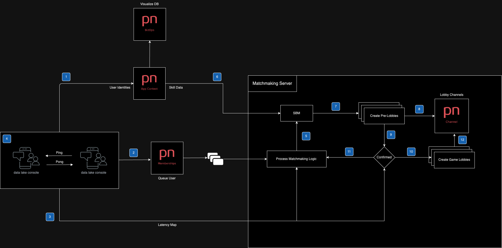
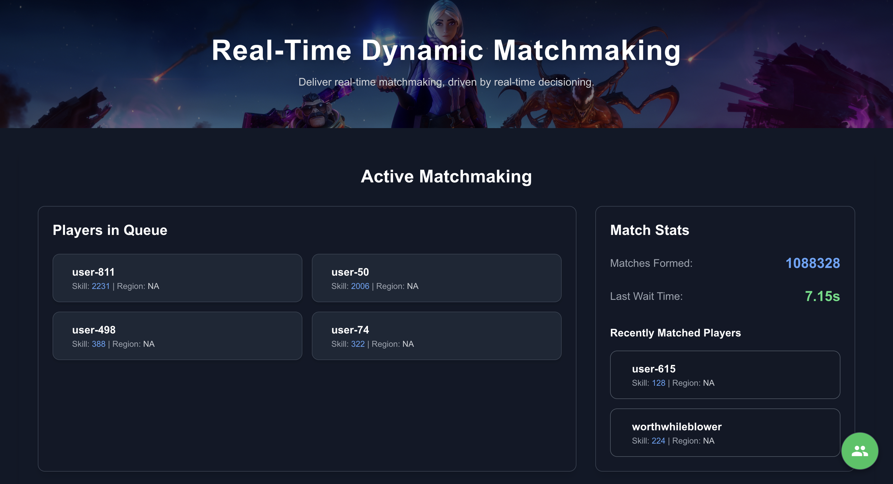

# Multiplayer Matchmaking System (SBMM) with PubNub

## Project Overview

This project focuses on creating a **Skill-Based Matchmaking (SBMM)** system for multiplayer games using **PubNub** for real-time data communication. The system is designed to dynamically match players based on their skill level (using ELO ratings), latency, region, and other customizable factors. The goal is to provide a flexible and scalable matchmaking solution that can be integrated into multiplayer games, ensuring balanced and optimized matches.

## Architecture Overview



## Client Application Overview



## Key Features

- **Skill-Based Matchmaking (SBMM)**: Players are matched based on their ELO ratings using the Hungarian algorithm for the most cost-optimal solution.
- **Real-time Communication with PubNub**: PubNub is utilized for handling real-time events such as player readiness, match notifications, and status updates.
- **Flexible Filtering**: Players can be filtered by region, latency, and other customizable factors to ensure fair and smooth matches.
- **Dynamic K-Factor for ELO Calculations**: The ELO rating system dynamically adjusts how quickly player ratings change based on their current rating.
- **Modular Structure**: The system is designed for easy expansion with a clear separation of logic, ensuring that additional features like API integration can be added later.

## Folder Structure

/multiplayer-matchmaking </br>
│</br>
|-- /src</br>
│&nbsp;&nbsp;&nbsp;|--- /config          # Configuration files (dynamic K-factor, PubNub config, etc.)</br>
│&nbsp;&nbsp;&nbsp;|--- /core            # Core matchmaking logic (main orchestrators, algorithms)</br>
│&nbsp;&nbsp;&nbsp;|--- /services        # Supporting services (player and queue management)</br>
│&nbsp;&nbsp;&nbsp;|--- /models          # Models representing players, lobbies, etc.</br>
│&nbsp;&nbsp;&nbsp;|--- /utils           # Utility functions (PubNub Functions, Error handling, etc.)</br>
│&nbsp;&nbsp;&nbsp;|--- /workers         # Background workers for matchmaking tasks</br>
│</br>
|-- /docker              # Docker configuration for containerization</br>
|-- /tests               # Unit and integration tests</br>
|-- /logs                # Logging for monitoring and debugging</br>
|-- package.json         # NPM dependencies and scripts</br>
|-- README.md            # Project documentation</br>
|-- .env                 # Environment variables</br>

## Getting Started

### Prerequisites

To run the project locally, you’ll need:

- **Node.js** (v14 or later)
- **Docker** (for containerization)
- **PubNub API Keys** (to handle real-time messaging and events)

### Installation

1. Clone the repository:

  ```bash
  git clone https://github.com/yourusername/multiplayer-matchmaking.git
  cd multiplayer-matchmaking
  ```

2. Install the dependencies for the server:

  ```bash
  npm install
  ```

3. Install the dependecies for the client:

  ```bash
  cd client
  npm install
  ```

3. Set up your .env file with PubNub credentials and other configuration settings:

  Main Directory (.env)

  ```
  PUBLISH_KEY=your-publish-key
  SUBSCRIBE_KEY=your-subscribe-key
  SECRET_KEY=your-secret-key
  ```

  ./client Directory (.env)

  ```
  PUBLISH_KEY=your-publish-key
  SUBSCRIBE_KEY=your-subscribe-key
  ```

4. Start the server

  In the Main Directory

  ```bash
  npm run build
  npm run start
  ```

5. Start the client

  ```bash
  cd client
  npm run dev
  ```

6.	(Optional) If you want to run the project in a Docker container:

  ```bash
  docker-compose up --build
  ```

## License

This project is licensed under the MIT License - see the LICENSE file for details.

This README provides an overview of the project, how to set it up, and the features it supports. Let me know if you’d like any modifications!


