# Multiplayer Matchmaking System (SBMM) with PubNub

Application to show how the scalability of PubNub can be utilized for Skill-based-matchmaking (SBMM) and improve the matchmaking experience.

## 🚀 Why PubNub for your Skill-Based-Matchmaking (SBMM) system

Peer-to-peer matchmaking processing can be enhanced using PubNub in a variety of ways

- PubNub enables instant communication between players and the server, ensuring that matchmaking decisions based on player status, ELO ratings, latency, and region happen in real-time without any delays.
- PubNub's globally distributed network allows the SBMM system to handle millions of concurrent users across different regions, ensuring low latency and seamless player connections worldwide.
- With [PubNub AppContext](https://www.pubnub.com/docs/general/metadata/basics) (Real-time Database), you can trust that player data is processed and transmitted with 0 downtime, leading to uninteruppted gameplayer experiences.
- Customize your matchmaking logic using the PubNub Platform with tools like [PubNub Illuminate](https://www.pubnub.com/products/illuminate/) which allow you to fine-tune and adapt matchmaking algorithms on the fly, using live data to dynamically adjust ELO ranges, latency filters, or regional preferences.
- PubNub's secure messaging ensures that player data remains private and protected, a critical feature of competitive gaming enviornments. </br></br>

Real-time: <30ms global delivery, regardless of concurrency. </br></br>
Scale: We handle 3 Trillion real-time API calls every month. </br></br>
Stability: 99.999& SLA provided for all players

## 🎮 Client Application Overview

This demo showcases how to run a Skill Based Matchmaking Algorithm in a production environment.

> This demo will give you an impression of the kind of real-time features you can add to your SBM matchmaking system with PubNub. The demo is written in our [TypeScript Chat SDK](https://www.pubnub.com/docs/chat/chat-sdk/overview) to make hosting easier. We also support client side engines such as [Unreal Engine](https://www.pubnub.com/docs/chat/unreal-chat-sdk/overview), and [Unity](https://www.pubnub.com/docs/chat/unity-chat-sdk/overview). This demo simulates "fake" clients to join matches, confirm the match that they have joined, and play a game updating their elo ratings accordingly. This demo is designed to run locally within a browser.


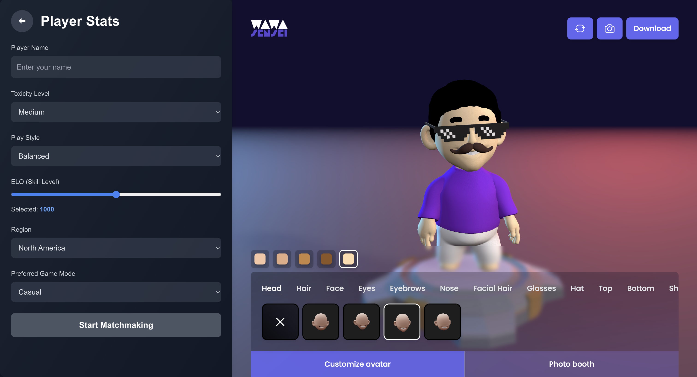

## 🏗 Architecture Overview

> This is architecture explains how the client communicates with the server componenet utilizing our [TypeScript Chat SDK](https://www.pubnub.com/docs/chat/chat-sdk/overview). This architecture is set up in a way where the individual user has to confirm the match they have joined before a game is actually created.

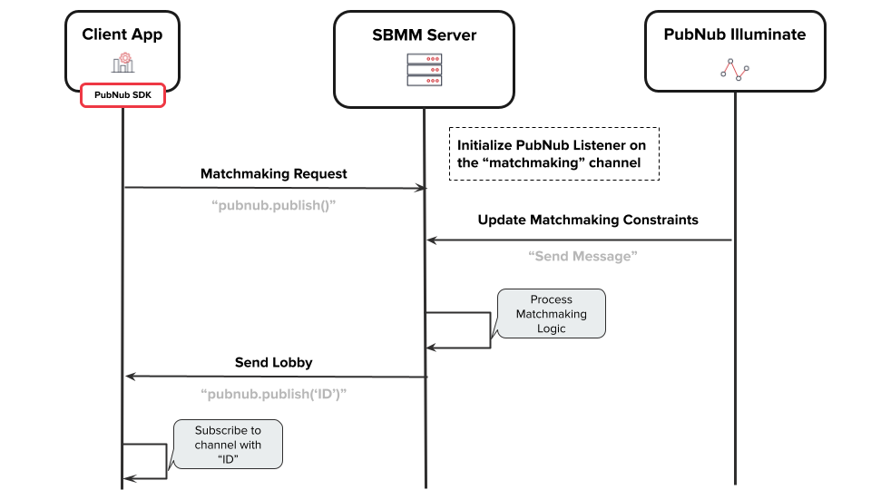

1. Client sends a matchmaking request using pubnub.publish("Location ID")
2. Server listens for matchmaking requests
3. Server gets matchmaking constrainsts by utilizing PubNub Illuminate
4. Server grabs details about User from PubNub App Context
5. Server processes matchmaking request using matchmaking constraints and user details
6. Server creates a PubNub "lobby" channel and sends it to the corresponding matched players

## 📂 Folder Structure

<pre>
/multiplayer-matchmaking
│
├── /src
│   ├── /config          # Configuration files (dynamic K-factor, PubNub config, etc.)
│   ├── /core            # Core matchmaking logic (main orchestrators, algorithms)
│   ├── /utils           # Utility functions (PubNub Functions, Error handling, etc.)
├── /client              # Client-side application for user interactions
│   ├── /public          # Public assets for the client application
│   ├── /src             # Source code for the client application
│   │   ├── /app         # Layout for the client
│   │   ├── /components  # UI components for the client
│   │   ├── /context     # Context providers for state management
│   ├── .env             # Environment variables for the client
│   ├── package.json     # NPM dependencies and scripts for the client
│
├── /docker              # Docker configuration for containerization
├── /tests
│   ├── /test-runner.ts  # Simulates a individual client
├── /logs                # Logging for monitoring and debugging
├── package.json         # NPM dependencies and scripts for the main server
├── README.md            # Project documentation
├── .env                 # Environment variables for the main server
</pre>

## 🚀 Getting Started

### 🛠 Prerequisites

To run the project locally, you’ll need:

- **Node.js** (v14 or later)
- **Docker** (for containerization)
- **PubNub API Keys** (to handle real-time messaging and events)

### 🔑 Get Your PubNub Keys

1. You’ll first need to sign up for a [PubNub account](https://admin.pubnub.com/). Once you sign up, you can get your unique PubNub keys from the [PubNub Developer Portal](https://admin.pubnub.com/).

1. Sign in to your [PubNub Dashboard](https://admin.pubnub.com/).

1. Click Apps, then **Create New App**.

1. Give your app a name, and click **Create**.

1. Click your new app to open its settings, then click its keyset.

1. Enable the Stream Controller feature on your keyset (this should be enabled by default after you created the keyset)

1. Enable the Message Persistence feature on your keyset and choose a duration

1. Enable the App Context feature.  **Important**: It is recommended to also uncheck the `Disallow Get All User Metadata` option for this demo.

1. Enable the File Sharing feature.

1. Copy the Publish and Subscribe keys and paste them into your app as specified in the next step.

### 📥 Installation

1. Clone the repository:

  ```bash
  git clone https://github.com/yourusername/multiplayer-matchmaking.git
  cd multiplayer-matchmaking
  ```

2. Install the dependencies for the server:

  ```bash
  npm install
  ```

3. Install the dependecies for the client:

  ```bash
  cd client
  npm install
  ```

3. Set up your .env file with PubNub credentials and other configuration settings:

  Main Directory (.env)

  ```
  PUBLISH_KEY=your-publish-key
  SUBSCRIBE_KEY=your-subscribe-key
  SECRET_KEY=your-secret-key
  ```

  ./client Directory (.env)

  ```
  PUBLISH_KEY=your-publish-key
  SUBSCRIBE_KEY=your-subscribe-key
  ```

4. Start the server

  In the Main Directory

  ```bash
  npm run build
  npm run start
  ```

5. Start the client

  ```bash
  cd client
  npm run dev
  ```

6.	(Optional) If you want to run the project in a Docker container:

  ```bash
  docker-compose up --build
  ```

## 📊 Setting up PubNub Illuminate for Matchmaking Optimization
> PubNub’s latest product release, Illuminate, is a scalable decision-making tool that we have built to help game developers, product managers, and project managers build, iterate, and experiment within the PubNub platform. Designed to drive a better player experience and can be utilized for configuring a "personalized" SBMM algorithm.

[Business Object](https://www.pubnub.com/docs/illuminate/business-objects/basics): A model of data you want to process/track. </br>
[Decision](https://www.pubnub.com/docs/illuminate/decisions/basics): Apply conditions to your business objects and take actions when conditions are met. </br>
[Dashboard](https://www.pubnub.com/docs/illuminate/dashboards/create-dashboards-and-charts#use-case): Visualize metric data and monitor actions in real-time.

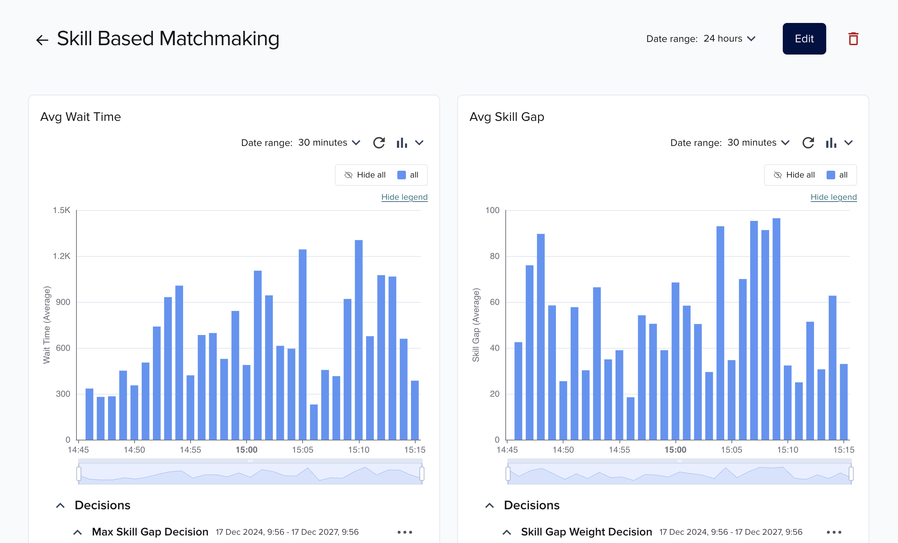

### 🏗 Configure Business Objects

1. Sign in to your [PubNub Dashboard](https://admin.pubnub.com/)

2. On the side menu click the drop down **Illuminate** -> **Business Objects**

3. Create a new Business Object by clicking **Create Business Object**

4. Enter a **Name** and **Description** and select the keyset the Business Object will exsist under

5. Make sure the Business Object is Deactivated and click on **Edit**. This is where you will map the data being sent through PubNub.

6. For this demo I have mapped the following variables into Illuminate.

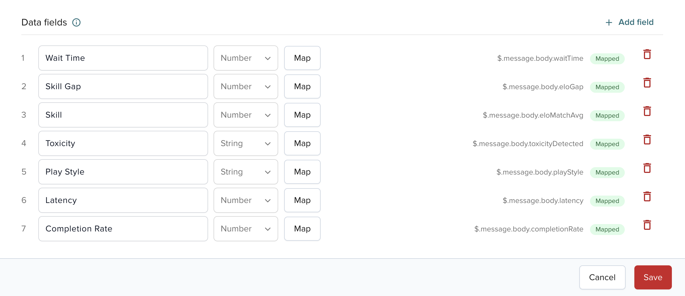

### 🏗 Setting up a Illuminate Decision

> After setting up a **Business Object** we are able to use this to create a **Decision** within Illuminate. The first step of creating a decision is deciding how, where, and to who an **Action** is going to fire. This next part will show you how I configured my decision for this demo.

1. Navigate to the Decisions tab

2. Click on Create Decision

3. Fill out the fields Name and Description and click **+ Add action**

4. Under the **Conditions** heading select the **Business Object** that was created

5. You can base your action off of **event** or **an aggregation**

6. Choose the metric that the decision will use and evaluate for its action/rule

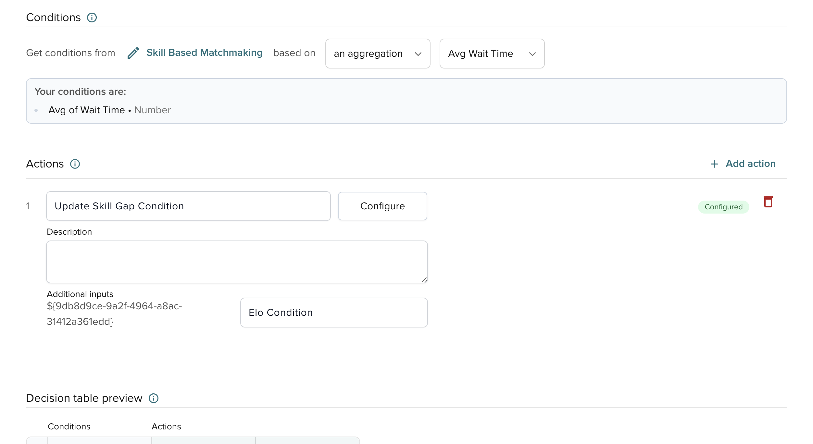

7. You can create multiple types of actions. For this demo I utilized using the **Send Message** action

8. If utilizing the **Send Message** action, enter the keyset you would like to use to fire this action

9. Fill out the **channel** the action fires on and the **body** of the message that will be sent.

10. You must embrace the message in quotes and you can optionally add variables (${variableThatChanges}).

Example: **`"Welcome to ${levelName}, enter discount code ${discountCode} within the first 5 minutes to buy ${purchaseItem}."`**

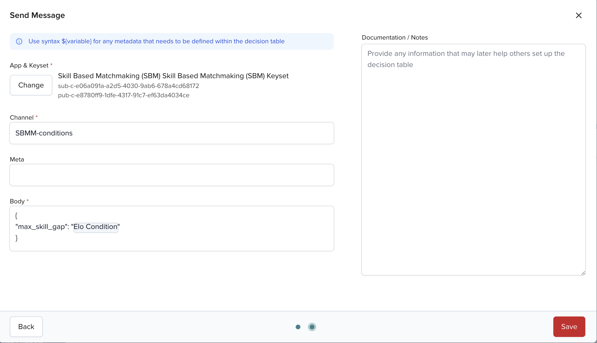

### 🏗 Setting up Illuminate Rules

> Now that we have set up a **Action** we are able to configure a rule set for when this action is going to fire. We will also be able to decide what the value of the variable set will be and when based off of our metrics.

1. Click on **Add Rules** or click on the decision and **Edit Rules** after creating your decision

2. Here we can add our conditions for when the action is going to fire

3. For example I used the following condition and set the variable that I configured in my action to the following values

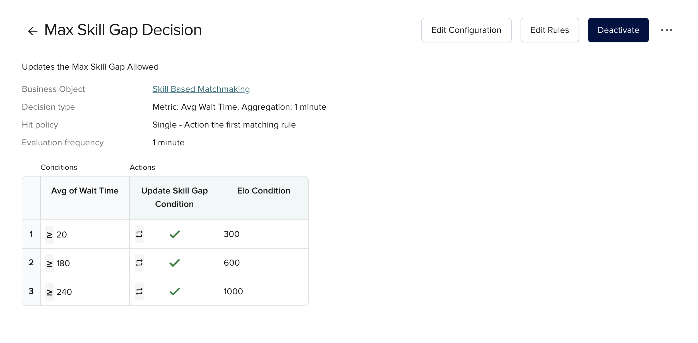

## 🔍 Monitor Users with BizOps Workspace

1. Sign in to your [PubNub Dashboard](https://admin.pubnub.com/).

2. On the side menu click the drop down BizOps Workspace

3. Under the drop down select User Management

4. Select the app and keyset you configured the SBMM repo with

5. This is the user management dashboard where you can visualize all the users in your game

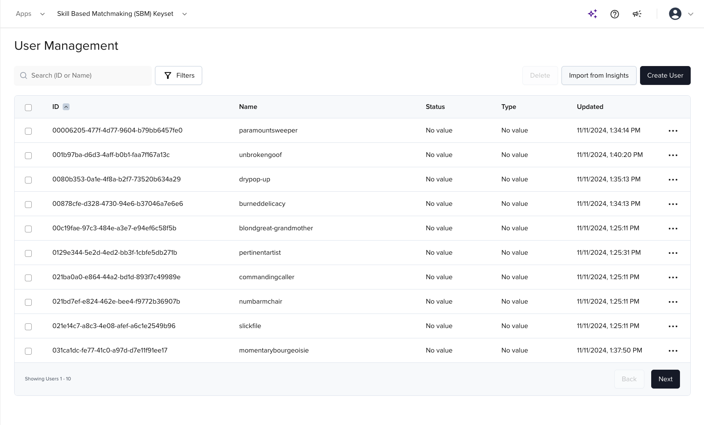

6. Click on an indivdual user to see their status, and state

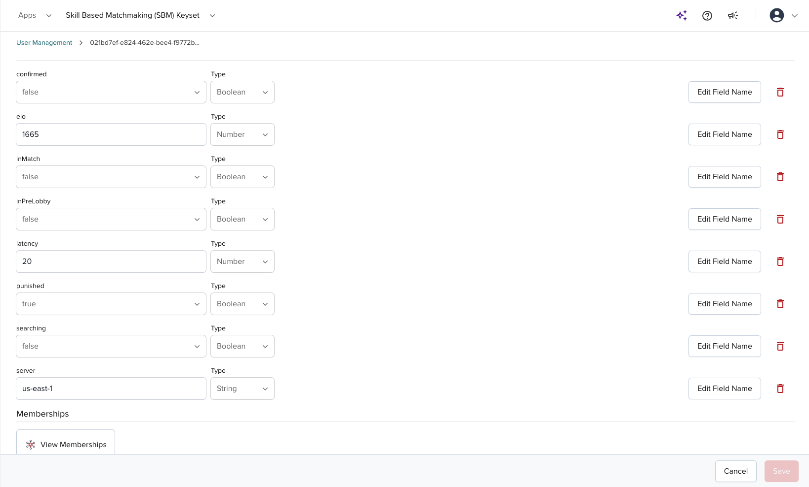

### 🔍 Visualize Game Lobbies using BizOps Workspace

1. Sign in to your [PubNub Dashboard](https://admin.pubnub.com/).

2. On the side menu click the drop down BizOps Workspace

3. Under the drop down select Channel Management

4. Select the app and keyset you configured the SBMM repo with

5. This is the channel management dashboard where you can visualize individual game lobbies and pre-game lobbies and the users that are part of them

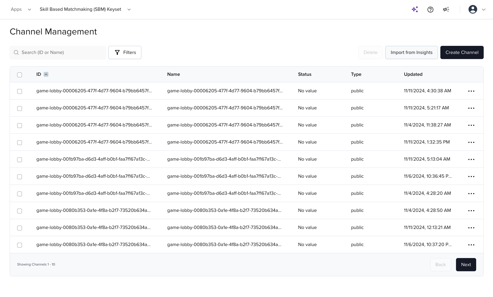

6. Click on an individual channel to see the status, and state

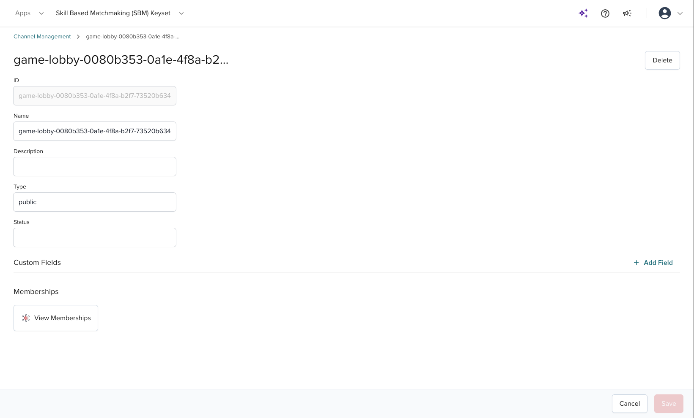

7. Click on view memberships to see who is active in that game lobby. If no one is active that means the game has ended

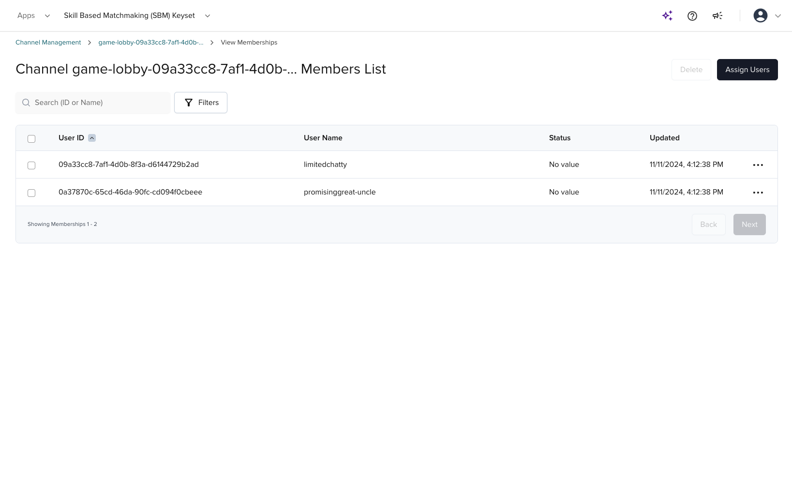
s

## License

This project is licensed under the MIT License - see the LICENSE file for details.


